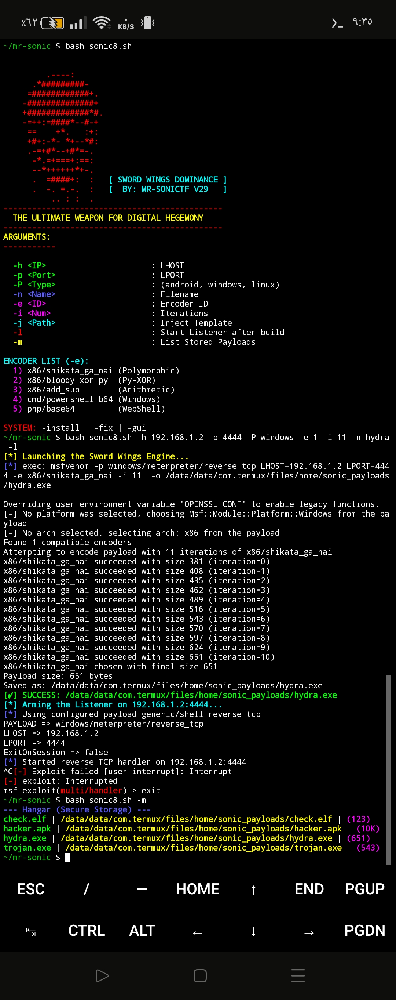
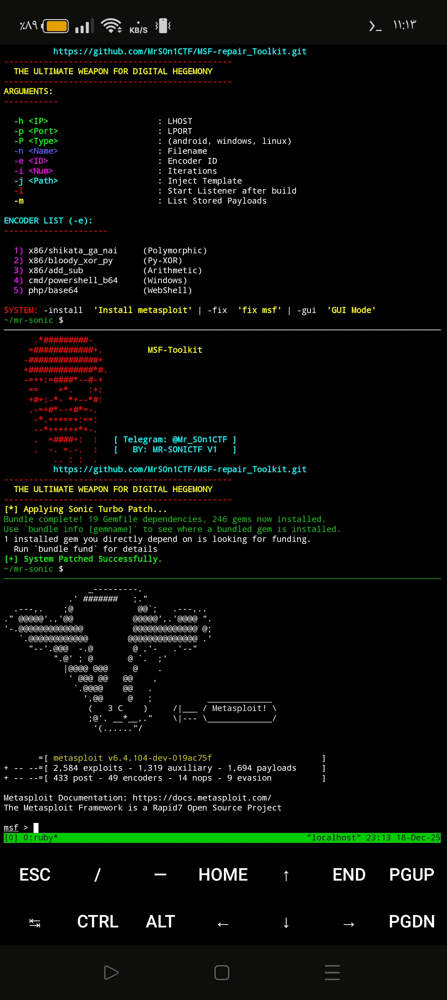
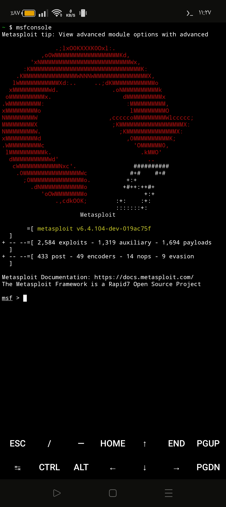

# 🦅 MSF-repair_ToolKit (V1.0 Stable)
**Developed by: MR-SONICTF** *The Ultimate Powerhouse for Metasploit Management on Termux.*

---

## 🛡️ Overview
**MSF-repair_ToolKit** is a professional-grade framework designed to automate the installation, repair, and management of the Metasploit-Framework on Android (Termux). This tool is the successor of several private development versions, now officially released as **V1.0** to provide a stable environment for security researchers.

## 🚀 Key Features
* **🛠️ Auto-Fix Engine**: Solves the famous `Nokogiri` and `Gumbo-parser` installation errors automatically.
* **💎 Advanced Payload Builder**: Generate encrypted payloads (APK, EXE, ELF) with multiple encoding iterations (e.g., *shikata_ga_nai*).
* **📡 Instant Listener**: One-click setup for `multi/handler` to catch your shells immediately.
* **📦 Hangar (Secure Storage)**: Integrated management system to track and list all your generated payloads with file sizes.
* **⚡ Turbo Repair**: Fast patching for `Bundler 2.6.2` and Ruby dependencies.

## 📸 Screenshots
### 💎 Payload Building & Advanced Encoding

 

### 🛠️ System Repair & Metasploit Launch

 

### ✅ Metasploit Launch



## 🛠️ Installation & Usage

1.  **Clone the repository:**
    ```bash
    git clone [https://github.com/MrS0n1CTF/MSF-repair_ToolKit](https://github.com/MrS0n1CTF/MSF-repair_ToolKit)
    cd MSF-repair_ToolKit
    ```

2.  **Give execution permissions:**
    ```bash
    chmod +x MSF-toolkit.sh.x
    ```

3.  **Run the Toolkit:**
    ```bash
    ./MSF-toolkit.sh.x
    ```

## 📖 Arguments Support
| Argument | Function |
| :--- | :--- |
| `-h <IP>` | Set LHOST (Local Host) |
| `-p <Port>` | Set LPORT (Local Port) |
| `-P <Type>` | Platform (android, windows, linux) |
| `-l` | Start Listener automatically after build |
| `-fix` | Run the Turbo Repair engine |
| `-install` | Fresh install of Metasploit & dependencies |
| `-gui` | Launch the Interactive Menu |

---

## ⚠️ Disclaimer
This tool is for **educational purposes** and **authorized penetration testing** only. The developer (**MR-SONICTF**) is not responsible for any misuse or illegal activities.

## 📱 Contact Developer
* **Telegram**: [@Mr_S0n1CTF](https://t.me/Mr_S0n1CTF)
* **GitHub**: [MrS0n1CTF](https://github.com/MrS0n1CTF)

---
© 2025 MR-SONICTF | Built for Digital Dominance.
