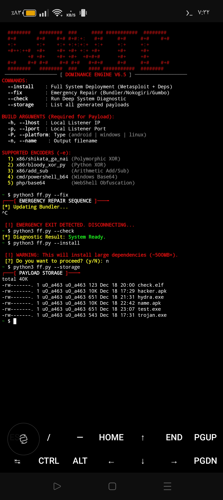
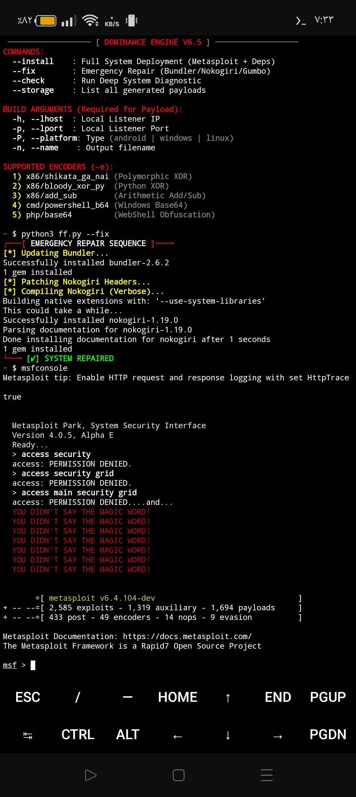

# Dominance Engine v6.5
Metasploit Deployment & Payload Automation Toolkit for Termux

---

## Project Purpose

This project was built to provide a **reliable, reproducible, and stable method**
for deploying, repairing, and operating the Metasploit Framework in constrained
Linux environments such as **Android Termux**.

The primary goal is **environment stability and automation**, not exploitation.
The engine focuses on solving recurring dependency and build failures related to
Ruby, Bundler, Nokogiri, and Gumbo, which commonly break Metasploit installations
on non-standard platforms.

---

## Threat Model & Scope

This toolkit does **not introduce new exploits** and does **not alter Metasploit
payload logic or internal modules**. It acts strictly as an automation and
orchestration layer on top of existing open-source tooling.

### In Scope
- Dependency installation and repair
- Metasploit framework deployment
- Automated payload generation via `msfvenom`
- Local artifact storage and tracking

### Out of Scope
- Zero-day exploitation
- Unauthorized access or lateral movement
- Persistence mechanisms
- Command and Control (C2) infrastructure
- Automatic listener or handler management

---

## Architecture Overview

The engine is designed as a layered system with clear separation of concerns:

1. **System Layer**
   - Handles package installation and environment preparation
   - Adapts to Termux filesystem and package constraints

2. **Repair Layer**
   - Fixes Ruby, Bundler, and Nokogiri build failures
   - Applies manual header patching when required
   - Forces compilation using system libraries for stability

3. **Execution Layer**
   - Wraps `msfvenom` execution inside a controlled subprocess
   - Provides execution feedback without modifying Metasploit internals

4. **Storage Layer**
   - Stores generated payloads in a dedicated directory
   - Enables easy inspection, tracking, and cleanup of artifacts

---

## Design Decisions

- Metasploit is executed **as-is** without patching its source code
- All system calls are isolated and executed explicitly
- No background services or listeners are started automatically
- Payload generation requires explicit user-supplied parameters
- No persistence or post-exploitation logic is implemented

---

## Defensive Perspective

From a defensive and blue-team perspective, this toolkit can be used to:

- Reproduce attacker payload generation techniques in a controlled lab
- Test endpoint detection and response (EDR) solutions
- Analyze how encoding and iteration affect payload signatures
- Validate SOC detection rules and alerting pipelines
- Train analysts on real-world attacker tooling behavior

---

## Screenshots & Runtime Evidence

### Payload Build Engine & Encoders
Demonstrates payload generation workflow, encoder selection, and storage handling.

---

### Emergency Repair Sequence
Shows automated recovery of Ruby, Bundler, and Nokogiri failures.

---

### Metasploit Framework Launch
Validates successful deployment and execution of Metasploit on Termux.

---

## Known Limitations

- Designed specifically for Termux-based environments
- Requires significant storage space during installation
- Payload execution and listener management are not handled
- No sandboxing or containment is provided by default

---

## Legal & Ethical Notice

This project is intended **strictly for educational purposes, security research,
and authorized penetration testing**.

The author does not condone or support illegal activity.
Users are fully responsible for ensuring compliance with all applicable laws
and regulations in their jurisdiction.

---

© 2026 MR-SONICTF  
Built for controlled environments, research accuracy, and operational stability.
